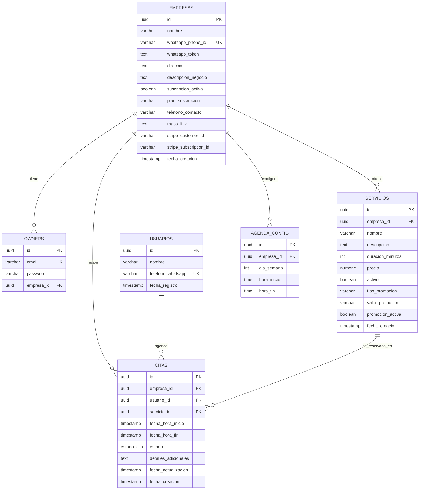

# Modelo de Datos y Diagrama Entidad-Relación (ER)

Este documento describe la estructura lógica de la base de datos de **Whappify**, detallando las tablas, columnas, tipos de datos, restricciones y relaciones.

---

## 🗺️ Diagrama Entidad-Relación (Mermaid)

El siguiente diagrama representa visualmente las tablas y sus relaciones (llaves primarias, foráneas y cardinalidad):

---

## 🗂️ Boceto y Diccionario de Datos

### 1. Tabla: `empresas`
Almacena la información de configuración de cada negocio o local afiliado.
* **`id`** (UUID, PK): Identificador único autogenerado.
* **`nombre`** (VARCHAR 100, NOT NULL): Nombre comercial del negocio.
* **`whatsapp_phone_id`** (VARCHAR 50, UNIQUE, NOT NULL): ID del teléfono registrado en la API de Meta.
* **`whatsapp_token`** (TEXT): Token de acceso permanente para interactuar con WhatsApp.
* **`direccion`** (TEXT): Dirección física del negocio (usado por la IA).
* **`descripcion_negocio`** (TEXT): Prompt especializado con instrucciones y descripción del negocio.
* **`suscripcion_activa`** (BOOLEAN, DEFAULT TRUE): Estado de la cuenta.
* **`plan_suscripcion`** (VARCHAR 50, DEFAULT 'BASIC'): Valores soportados: `BASIC`, `PREMIUM`.
* **`telefono_contacto`** (VARCHAR 20): Teléfono de soporte humano.
* **`maps_link`** (TEXT): Enlace de Google Maps del local (Premium).
* **`stripe_customer_id`** / **`stripe_subscription_id`** (VARCHAR 255): Datos de facturación de Stripe.

### 2. Tabla: `owners`
Contiene las credenciales administrativas de acceso para el Dashboard de los propietarios.
* **`id`** (UUID, PK): Identificador único.
* **`email`** (VARCHAR 150, UNIQUE, NOT NULL): Correo electrónico del administrador.
* **`password`** (VARCHAR 255, NOT NULL): Hash Bcrypt de la contraseña.
* **`empresa_id`** (UUID, FK -> `empresas.id`): Empresa a la que administra.

### 3. Tabla: `usuarios`
Registra a los clientes finales que interactúan con el bot de WhatsApp.
* **`id`** (UUID, PK): Identificador único.
* **`nombre`** (VARCHAR 100): Nombre extraído de su perfil de WhatsApp.
* **`telefono_whatsapp`** (VARCHAR 20, UNIQUE, NOT NULL): Número de teléfono normalizado (ej: `5255...`).

### 4. Tabla: `servicios`
Catálogo de servicios que ofrece cada empresa.
* **`id`** (UUID, PK): Identificador único del servicio.
* **`empresa_id`** (UUID, FK -> `empresas.id`): Negocio dueño del servicio.
* **`nombre`** (VARCHAR 100, NOT NULL): Nombre del servicio (ej: "Servicio de boda").
* **`descripcion`** (TEXT): Detalle amigable del servicio.
* **`duracion_minutos`** (INT, DEFAULT 30): Duración del servicio para el cálculo de bloques.
* **`precio`** (NUMERIC 10,2, NOT NULL): Costo en pesos mexicanos.
* **`activo`** (BOOLEAN, DEFAULT TRUE): Visibilidad en WhatsApp y el catálogo.
* **`tipo_promocion`** (VARCHAR 50): Valores soportados: `NINGUNA`, `PREDEFINIDA`, `DESCUENTO_PORCENTAJE`, `PERSONALIZADA`, `SERVICIO_GRATIS`, `DOS_POR_UNO`.
* **`valor_promocion`** (VARCHAR 100): Detalle, porcentaje o valor asociado a la promoción.
* **`promocion_activa`** (BOOLEAN): Estado del descuento en el catálogo.

### 5. Tabla: `agenda_config`
Configura los horarios permitidos para citas por día.
* **`id`** (UUID, PK): Identificador único.
* **`empresa_id`** (UUID, FK -> `empresas.id`): Negocio asociado.
* **`dia_semana`** (INT, CHECK 0-6): Día de la semana (0 = Domingo, 1 = Lunes, ..., 6 = Sábado).
* **`hora_inicio`** / **`hora_fin`** (TIME, NOT NULL): Horas de atención del día.

### 6. Tabla: `citas`
Almacena las citas agendadas por los usuarios.
* **`id`** (UUID, PK): Identificador único de la cita.
* **`empresa_id`** (UUID, FK -> `empresas.id`)
* **`usuario_id`** (UUID, FK -> `usuarios.id`)
* **`servicio_id`** (UUID, FK -> `servicios.id`)
* **`fecha_hora_inicio`** / **`fecha_hora_fin`** (TIMESTAMP, NOT NULL): Horarios de la cita.
* **`estado`** (VARCHAR ENUM): Valores soportados: `PENDIENTE`, `CONFIRMADA`, `CANCELADA`.
