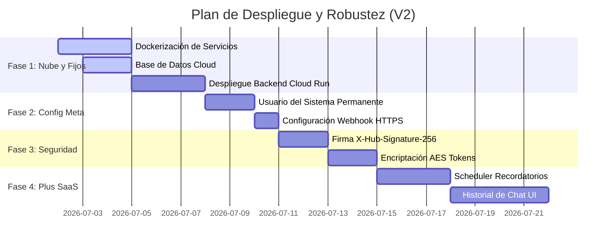

# Plan de Acción y Hoja de Ruta - Recepcionista Virtual (V2)

Este documento define la planificación estratégica y técnica para la transición del proyecto desde su estado actual de prototipo de desarrollo local (MVP) hacia una solución SaaS comercial en producción.

---

## 🎯 Objetivo General
Eliminar la dependencia de túneles temporales de red local (`localtunnel`/`ngrok`), desplegar el backend y frontend de manera persistente con HTTPS en la nube, garantizar la estabilidad perpetua de las credenciales de Meta Developer, e incorporar capas críticas de seguridad y funcionalidades SaaS de valor agregado.

---

## 🛑 1. Actividades Críticas (Bloqueantes para Producción)

### A. Despliegue en la Nube (Eliminación de localtunnel)
Para asegurar que la conexión funcione 24/7 y evitar reconfigurar la callback de Meta diariamente, se debe implementar la arquitectura de nube:

1. **Base de Datos Cloud**:
   - Crear una base de datos PostgreSQL administrada en la nube (ej. **Google Cloud SQL** o **Supabase/Neon**).
   - Migrar el esquema actual de tablas.
2. **Contenerización (Docker)**:
   - Crear un `Dockerfile` optimizado (multi-stage build) para el backend Spring Boot (Java 17).
   - Crear un `Dockerfile` para el frontend Angular compilado con Nginx para servir archivos estáticos.
3. **Despliegue de Servicios**:
   - **Backend**: Desplegar en **Google Cloud Run** o **Render/AWS App Runner** para obtener escalabilidad automática a bajo costo y una URL HTTPS permanente.
   - **Frontend**: Desplegar en **Vercel** o **Netlify** para carga ultra rápida y despliegue continuo desde Git.
4. **Callback URL Permanente**:
   - Actualizar permanentemente la configuración de Webhook en la consola de **Meta Developer** apuntando a: `https://tu-dominio-backend.com/api/v1/whatsapp/webhook`.

### B. Credenciales y Tokens Permanentes de Meta (WhatsApp)
El token temporal de Meta expira cada 24 horas. Para producción se debe:
1. **Configurar un System User (Usuario del Sistema)** en el **Meta Business Portfolio (Business Manager)** del negocio.
2. **Generar un Token de Acceso Permanente** sin fecha de caducidad con los permisos `whatsapp_business_messaging` y `whatsapp_business_management`.
3. **Verificar el Negocio en Meta** para eliminar el límite de envío a números de prueba y habilitar que cualquier cliente del mundo pueda chatear con el bot.

### C. Seguridad y Verificación de Webhooks
1. **Validación de Firma de Meta (`X-Hub-Signature-256`)**:
   - Meta envía una firma criptográfica en los headers de cada webhook. Debemos validar esta firma en [WhatsAppWebhookController.java](file:///c:/Users/Ricardo/.gemini/antigravity/scratch/hackaton-recepcionist-agent/backend/src/main/java/com/example/agente/controller/WhatsAppWebhookController.java) usando el *App Secret* de Meta para garantizar que ninguna petición falsa intente agendar o inyectar logs en el backend.
2. **Encriptación de Tokens de Empresa**:
   - Como múltiples empresas registrarán sus propios números y tokens de WhatsApp en nuestra base de datos, debemos encriptar los campos `whatsapp_api_token` y `whatsapp_phone_id` en la base de datos usando criptografía reversible AES-256 (mediante Spring Security Crypto) para evitar fugas de tokens confidenciales.
3. **Gestión de Secretos y Variables de Entorno**:
   - Para producción, todas las credenciales sensibles (tales como la contraseña de base de datos `spring.datasource.password`, las claves privadas de API de Stripe `stripe.api.key` y los tokens globales de Meta `whatsapp.api.token`) **no deben ser hardcodeadas ni guardarse en application.properties**.
   - Se utilizará un servicio de almacenamiento seguro de secretos como **Google Secret Manager** (o variables de entorno de AWS) inyectándolos en tiempo de ejecución del contenedor en Google Cloud Run. En local continuaremos usando variables del properties por simplicidad de desarrollo.
4. **Autenticación y Autorización del Dashboard (Spring Security + JWT)**:
   - Para proteger el acceso de los dueños de negocios a sus respectivos dashboards y configuraciones, se implementará la seguridad robusta del backend:
     - Encriptación unidireccional de contraseñas de administradores/propietarios usando **BCryptPasswordEncoder** en la base de datos.
     - Generación de un token **JWT (JSON Web Token)** firmado criptográficamente con una clave secreta robusta (HMAC-SHA512) al iniciar sesión de manera exitosa (`POST /api/v1/auth/login`).
     - Creación de un filtro interceptor en Spring Boot (`JwtFilter` extendiendo `OncePerRequestFilter`) que valide la firma, vigencia (ej. expiración en 24 horas) y extraiga el `empresaId` de los claims para asociar de manera segura el contexto de seguridad del hilo.
     - Almacenamiento seguro en el cliente y envío del header HTTP `Authorization: Bearer <token>` en cada request.

### D. Monetización y Cobro de Suscripciones (Análisis de Pasarela)
Para habilitar el cobro comercial a las empresas que utilicen el chatbot, se analizan dos alternativas principales de monetización:

#### Alternativa 1: Stripe Checkout (Pasarela de Pago Automatizada) - *Recomendado*
* **Implementación**:
  - El frontend Angular redirige a una sesión segura de Stripe Checkout. Al pagar exitosamente, Stripe envía un evento HTTP POST (Webhook de Stripe) al backend.
  - El backend valida la firma de Stripe (`stripe.webhook.secret`) y actualiza el campo `suscripcion_activa = true` y la fecha de vigencia de la empresa de manera automática.
* **Ventajas**:
  - Automatización total del modelo SaaS ("self-serve"), sin requerir personal administrativo.
  - Cargo recurrente automatizado cada mes.
* **Desventajas**:
  - Comisión transaccional cobrada por la plataforma (~3.6% + $3.00 MXN en México).

#### Alternativa 2: Transferencia Bancaria Directa (SPEI / Depósito) - *Alternativa Manual*
* **Implementación**:
  - El frontend del Dashboard muestra una pantalla con los datos bancarios del dueño del SaaS (Clabe, Banco, Beneficiario).
  - El backend requiere una interfaz en un panel super-administrador donde se listen las solicitudes pendientes de activación, permitiendo a un humano autorizar la suscripción y cambiar `suscripcion_activa = true` tras revisar la banca del negocio.
* **Ventajas**:
  - Margen de ganancia del 100% (sin comisiones de pasarela de pago).
* **Desventajas**:
  - Carga operativa constante (conciliación manual de depósitos).
  - Riesgo de demoras en la reactivación del servicio para el cliente, afectando la experiencia de usuario.
  - No permite cobros de cobro recurrente automático (el cliente debe transferir manualmente cada mes).

---

## ✨ 2. Actividades No Críticas (Funcionalidades de Valor para el SaaS)

### A. Recordatorios Automáticos de Citas
* **Spring Boot Scheduler (`@Scheduled`)**:
  - Implementar un cronjob en el backend que corra cada 10 minutos buscando citas agendadas que inicien dentro de las próximas 2 horas.
  - Enviar automáticamente un mensaje por WhatsApp al cliente: *"Hola, te recordamos que tienes una cita de Corte de Cabello Premium hoy a las 05:00 PM en Barbería Estilo Clásico. ¿Deseas confirmar tu asistencia o cancelar?"*.

### B. Intervención Humana (Takeover del Chat)
* **Pausa de la IA**:
  - Agregar un flag `bot_activo` (boolean) en la tabla `usuarios` o `chat_sessions`.
  - Crear un botón en el Dashboard para que el administrador pueda "Pausar el Bot" para ese cliente.
  - Si el bot está pausado, el webhook simplemente guarda el mensaje del cliente en el historial pero **no responde**. Esto permite al dueño chatear manualmente de forma directa sin que la IA interfiera.

### C. Historial de Chat y Conversaciones en el Dashboard
* **Monitoreo en Tiempo Real**:
  - Crear una tabla `logs_conversacion` para guardar cada mensaje entrante y saliente.
  - Crear una vista de "Mensajes" en el dashboard Angular para que el dueño del negocio pueda auditar qué platicó el cliente con la IA y ver exactamente en qué punto se agendó.

### D. Métricas y Analytics del Negocio
* **Dashboard Estadístico**:
  - Gráficas de volumen de citas agendadas por día.
  - Tasa de cancelación del bot.
  - Estimación de ingresos totales mensuales estimulados por la IA del bot.

---

## 📈 3. Plan de Trabajo Sugerido (Fases)

---

## 🛡️ Resumen de Infraestructura Propuesta para Producción

| Componente | Opción Recomendada | Razón Principal | Costo Aprox. |
| :--- | :--- | :--- | :--- |
| **Backend API** | Google Cloud Run / Render | Serverless, escala a 0 cuando no hay mensajes. | $0 - $5 USD/mes |
| **Frontend UI** | Vercel / Netlify | CDN global, despliegue continuo rápido. | Capa Gratuita |
| **Base de Datos** | Supabase Postgres / Cloud SQL | Escalabilidad, respaldos automáticos y SSL. | $0 - $10 USD/mes |
| **Motor de IA** | Vertex AI (Gemini 2.5 Flash) | Pago por uso de tokens, latencia ultra baja. | < $1 USD por cada 10,000 chats |
