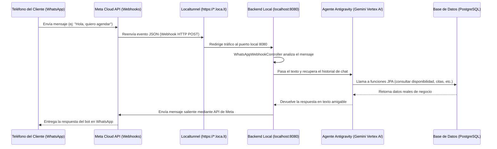

# Manual de Pruebas de Chat en Entorno Local (WhatsApp API + Backend)

Este manual ha sido diseñado para que los colaboradores y desarrolladores del equipo puedan realizar pruebas completas del chatbot de agendamiento inteligente (asistente de WhatsApp) en su máquina de desarrollo local.

---

## 🛠️ Arquitectura de Comunicación en Desarrollo
Dado que Meta (Facebook) requiere una URL pública con HTTPS para enviarnos los mensajes de WhatsApp en tiempo real, el flujo local de desarrollo funciona así:



---

## 📋 Requisitos Previos

### 1. Acceso a la Consola de Meta Developers
Para realizar pruebas con el número del local, se debe acceder a la aplicación registrada de WhatsApp:
1. Iniciar sesión en [Meta Developers Console](https://developers.facebook.com/).
2. Ir a la sección **Mis Aplicaciones** y seleccionar el proyecto del asistente de agendamiento.
3. En el menú izquierdo, desplegar **WhatsApp** y seleccionar **Configuración de la API**.
4. Aquí encontrarás:
   - **Identificador de teléfono de WhatsApp (Phone Number ID)**: Usado como `whatsapp_phone_id` en la BD.
   - **Token de acceso temporal**: Que expira cada 24 horas (pegar en el properties).
   - **Teléfono de prueba**: El número asignado por Meta al que le debes mandar los mensajes.

### 2. Registrar Números de Prueba (Sandbox)
Si estás usando una cuenta de desarrollador en modo Sandbox (gratuita):
* **IMPORTANTE**: Meta solo enviará y responderá mensajes a números telefónicos que hayan sido agregados explícitamente en la sección **"Para" (To)** de la configuración de la API.
* Ve a la sección **Configuración de la API**, localiza la caja de la derecha ("Configura tu cuenta de WhatsApp") y agrega los números de los colaboradores para autorizarlos.

---

## 🚀 Pasos para Iniciar las Pruebas Locales

### Paso 1: Levantar la Base de Datos PostgreSQL
Asegúrate de que tu contenedor o instancia local de Postgres esté corriendo:
```bash
docker-compose up -d
```
*(Valida con DBeaver o pgAdmin que la base de datos `agendamiento_db` responda en el puerto `5432`).*

### Paso 2: Configurar las Credenciales en Backend
Abre el archivo [application.properties](file:///c:/Users/Ricardo/.gemini/antigravity/scratch/hackaton-recepcionist-agent/backend/src/main/resources/application.properties) y actualiza el token temporal de Meta:
```properties
whatsapp.api.token=EAAqjlfsIrEkB... (Pega el token vigente de Meta)
```

### Paso 3: Iniciar el Servidor Backend
En la terminal, dirígete a la carpeta `backend` e inicia la aplicación Spring Boot:
```bash
cd backend
./mvnw spring-boot:run
```
*(Verifica que la consola muestre `Started AgenteApplication on port 8080`).*

### Paso 4: Levantar el Túnel Público de Red
Abre una nueva terminal e inicia `localtunnel` apuntando al puerto `8080` de tu backend:
```bash
npx -y localtunnel --port 8080
```
La consola te devolverá una URL pública como: `https://xxxx-xxxx-xxxx.loca.lt`.

### Paso 5: Configurar el Webhook en Meta Developers
1. En el panel lateral izquierdo de Meta Developers, haz clic en **WhatsApp** > **Configuración**.
2. En la sección **Webhook**, haz clic en **Editar**.
3. Pega la URL del paso anterior concatenando el endpoint del webhook:
   `https://xxxx-xxxx-xxxx.loca.lt/api/v1/whatsapp/webhook`
4. En **Token de verificación**, introduce el token secreto configurado en tu properties:
   `MiTokenSecretoDelHackathon2026`
5. Haz clic en **Guardar**.
6. En la misma pantalla, bajo **Campos del Webhook**, asegúrate de que la suscripción de **messages** esté activada (debe decir *Suscrito*).

---

## 🧪 Flujo de Casos de Prueba Recomendados

Una vez que el webhook esté configurado, abre WhatsApp en tu teléfono registrado y envía los siguientes mensajes de prueba al número de WhatsApp de prueba de Meta:

| Caso de Prueba | Mensaje del Cliente | Comportamiento Esperado |
| :--- | :--- | :--- |
| **1. Saludo Inicial** | *"Hola"* | El bot debe saludar amigablemente y mencionar que es asistente de la barbería/local. |
| **2. Consultar Servicios** | *"¿Qué servicios ofrecen?"* | El bot invocará la función del catálogo y listará los servicios (Corte de Cabello Premium, Afeitado Imperial) con sus respectivos precios y duraciones. |
| **3. Consultar Horarios** | *"¿Hasta qué hora abren hoy?"* | El bot llamará a `obtenerHorariosAtencion` y devolverá el rango oficial de lunes a sábado de 9:00 AM a 6:00 PM. |
| **4. Buscar Espacio** | *"Quiero agendar un corte para mañana"* | El bot identificará la fecha actual de 2026, consultará los slots libres mediante `consultarDisponibilidad` y te propondrá la lista de horas libres. |
| **5. Agendamiento Completo** | *"A las 10:00 AM por favor"* | El bot invocará `agendarCita` y te confirmará la reservación del servicio en la base de datos para esa hora exacta. Puedes comprobar que la cita aparece de inmediato en tu Dashboard. |
| **6. Validación de Ocupado** | *"Quiero agendar corte mañana a las 10 AM"* | Dado que el horario a las 10:00 AM ya se agendó en el paso anterior, el bot debe informarte que el horario ya está ocupado y pedirte que elijas otro. |
| **7. Cancelación** | *"Me surgió algo, necesito cancelar mi cita de mañana"* | El bot consultará tus citas vigentes con `obtenerMisCitas`, listará tu cita a las 10:00 AM y, tras tu confirmación, llamará a `cancelarCita` liberando el horario en la base de datos. |
| **8. Preguntar por Humano** | *"Necesito hablar con una persona del local"* | El bot detectará la solicitud y te facilitará el teléfono de soporte oficial del negocio que tengas registrado en el Dashboard. |
| **9. Ubicación** | *"¿Dónde están y cómo llego en Maps?"* | El bot te devolverá la dirección del negocio escrita y te compartirá el link directo de Google Maps. |

---

## 🛠️ Diagnóstico de Problemas Comunes (Troubleshooting)

1. **El bot no responde nada en WhatsApp**:
   - Comprueba si el túnel localtunnel se cayó (prueba abriendo la URL del túnel en tu navegador: si te sale un error `503 Service Unavailable`, reinicia localtunnel en la consola y actualiza la URL en Meta Developers).
   - Verifica en los logs del backend si están entrando las peticiones de Meta (debe imprimir `--- MENSAJE ENTRANTE DETECTADO ---`).
2. **El webhook en Meta da error al guardar la URL**:
   - Asegúrate de que el backend de Spring Boot esté corriendo y escuchando en el puerto 8080 *antes* de guardar la URL del webhook.
   - Comprueba que el *Verify Token* en Meta sea exactamente idéntico al de tu properties.
3. **El backend lanza errores de base de datos al agendar**:
   - Asegúrate de que la empresa a la que pertenece el `whatsappPhoneId` haya sido dada de alta previamente en el Dashboard o el script SQL inicial, de lo contrario el webhook no podrá mapear la cita con una empresa existente.
