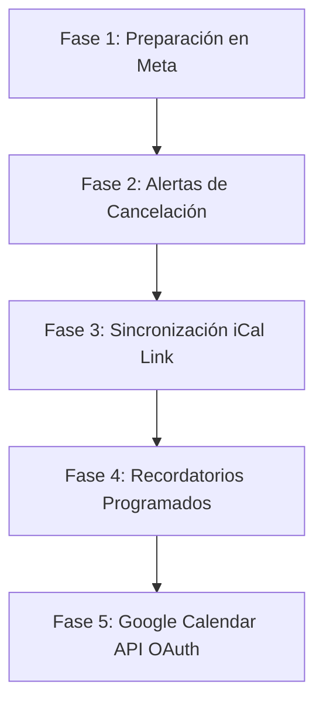

# Plan de Acción: Notificaciones de Citas y Sincronización con Google Calendar

Este plan de acción detalla las estrategias, arquitectura y pasos requeridos para implementar:
1. Alertas de cancelación e inicio de citas por WhatsApp para los usuarios finales.
2. Sincronización de citas en Google Calendar para los propietarios de los negocios.

---

## 💬 1. Alertas y Recordatorios por WhatsApp (Usuarios Finales)

Para interactuar de forma automática con los clientes a través de WhatsApp, debemos considerar la **regla de las 24 horas de Meta** (las plantillas personalizadas gratis solo se permiten dentro de las 24 horas posteriores al último mensaje del cliente).

### A. Alerta de Cancelación por el Dueño
Cuando el propietario cancela una cita desde el Dashboard:
1. **Flujo Técnico:**
   * El controlador intercepta la cancelación en el backend (`PUT /api/v1/citas/{id}/cancelar`).
   * Se verifica el tiempo transcurrido desde el último mensaje del cliente.
     * **Menos de 24 horas:** Se envía un mensaje de texto libre amigable vía API de WhatsApp.
     * **Más de 24 horas:** Se debe disparar un **Mensaje de Plantilla aprobado por Meta** (ej: `cancelacion_cita`).
2. **Mensaje Propuesto:**
   > *"Hola {{nombre}}, lamentamos informarte que tu cita para el servicio de {{servicio}} programada para el {{fecha}} a las {{hora}} ha sido cancelada por el negocio. Si tienes dudas, contáctanos al {{telefono_soporte}}."*

### B. Recordatorios Automáticos de Citas
Para evitar inasistencias ("no-shows"), programaremos recordatorios automáticos (24 horas antes y 2 horas antes de la cita).
1. **Flujo Técnico:**
   * **Opción Simple (Spring Boot @Scheduled):** Un proceso en segundo plano que corre cada hora en el backend buscando citas que inicien en un rango de 24 horas o 2 horas exactas.
   * **Opción Avanzada (Google Cloud Tasks o Quartz):** Al agendar la cita, se programa un evento retrasado en una cola de tareas.
   * **Regla Meta:** Al ser recordatorios proactivos, **siempre** deben usar una plantilla autorizada de tipo "Utility" en Meta (ej: `recordatorio_cita`).
2. **Mensaje Propuesto:**
   > *"Hola {{nombre}}, te recordamos que tienes una cita mañana para el servicio {{servicio}} a las {{hora}}. ¡Te esperamos!"*

---

## 📅 2. Sincronización con Google Calendar (Propietarios)

Proponemos tres alternativas de menor a mayor complejidad para mantener a los dueños informados:

### Alternativa A: Suscripción por iCal Link (La más sencilla y limpia)
* **Cómo funciona:** El backend expone un endpoint seguro y público que devuelve las citas en formato estándar de calendario `.ics` (ej: `https://api.whappify.com.mx/api/v1/agenda/exportar/{empresaId}/{tokenSecure}.ics`).
* El propietario simplemente copia este enlace y lo añade en su Google Calendar ("Añadir por URL").
* **Pros:** Cero integraciones complejas de OAuth, sin necesidad de permisos invasivos en las cuentas Google de los dueños, 100% gratis.
* **Cons:** La actualización no es en tiempo real inmediato (Google Calendar refresca los feeds externos cada ciertas horas).

### Alternativa B: Integración Oficial con Google Calendar API (Tiempo Real)
* **Cómo funciona:**
  1. El propietario hace clic en "Conectar Google Calendar" en el Dashboard.
  2. Pasa por el flujo de OAuth 2.0 de Google para dar permiso de escritura en su calendario (`https://www.googleapis.com/auth/calendar.events`).
  3. El backend almacena el `access_token` y `refresh_token` del usuario.
  4. Cada vez que una cita se crea o cancela, el backend realiza una petición HTTP en segundo plano a la API de Google Calendar para insertar/modificar el evento.
* **Pros:** Actualización inmediata en tiempo real.
* **Cons:** Requiere configurar la pantalla de consentimiento de OAuth de Google Cloud, y mantener tokens de acceso de manera segura.

### Alternativa C: Disparadores por Webhooks (No-code / Zapier / Make)
* **Cómo funciona:** El backend expone una opción en el perfil del negocio para ingresar una "URL de Webhook" externa. Al agendarse una cita, el backend envía un payload JSON a esa URL. El propietario configura una regla en Make.com o Zapier para insertar el evento en su Google Calendar.
* **Pros:** Extremadamente fácil de programar en el backend.
* **Cons:** El propietario debe saber usar Make/Zapier o pagar su suscripción.

---

## 🏁 3. Plan de Acción Recomendado para la Implementación

Para avanzar de forma iterativa y segura, se propone la siguiente ruta de implementación:

### 📋 Checklist de Pasos a Seguir

#### Fase 1: Preparación y Aprobación de Plantillas (Meta)
- [ ] Crear y enviar a aprobación en el panel de Meta Developer las dos plantillas de WhatsApp:
  * `cancelacion_cita` (Mensaje de alerta).
  * `recordatorio_cita` (Mensaje de utilidad).

#### Fase 2: Implementación de Alertas de Cancelación
- [ ] Crear la lógica de envío de mensajes en el backend al cancelar la cita desde el controlador de citas.
- [ ] Implementar la validación de ventana de 24 horas en el servicio de WhatsApp para decidir si enviar texto plano o plantilla.

#### Fase 3: Integración iCal para Propietarios (Fácil)
- [ ] Crear un servicio `AgendaExportService` que convierta las citas activas de una empresa al formato estándar iCalendar.
- [ ] Diseñar el endpoint público encriptado `/api/v1/agenda/exportar/{empresaId}/{token}`.
- [ ] Agregar un botón en el Dashboard que permita al propietario copiar su enlace de suscripción iCal.

#### Fase 4: Recordatorios Automáticos de Citas
- [ ] Habilitar `@EnableScheduling` en la clase principal de Spring Boot.
- [ ] Crear un componente programado (`@Scheduled(cron = "0 0 * * * *")`) que corra cada hora buscando citas próximas a 24h y 2h para enviar las plantillas correspondientes.

#### Fase 5: Integración Google Calendar API (Avanzada)
- [ ] Configurar credenciales de API y OAuth 2.0 en la consola de Google Cloud.
- [ ] Crear las rutas de callback OAuth `/api/v1/auth/google` en el backend para almacenar las credenciales encriptadas del propietario.
- [ ] Crear un servicio `GoogleCalendarService` que sincronice eventos en tiempo real al crear/cancelar citas.
